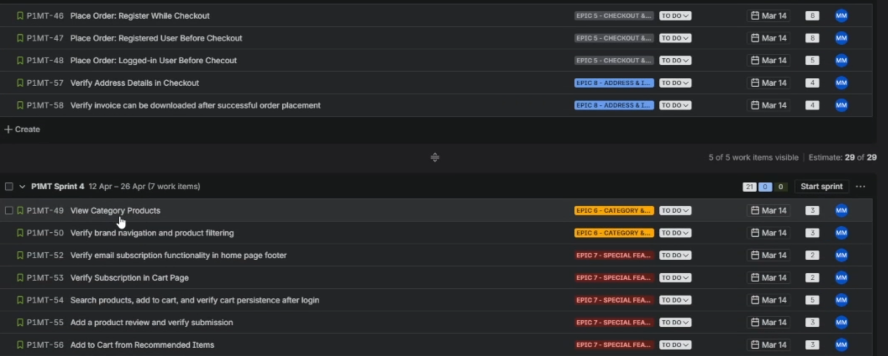
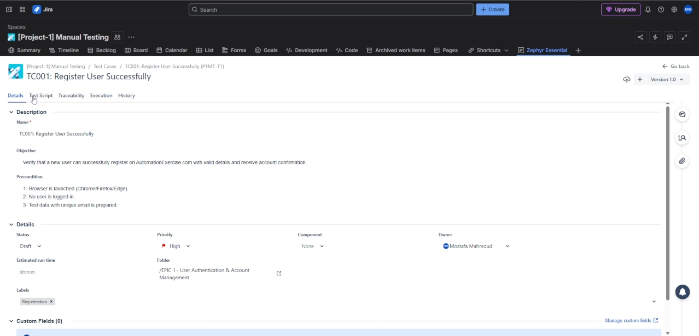
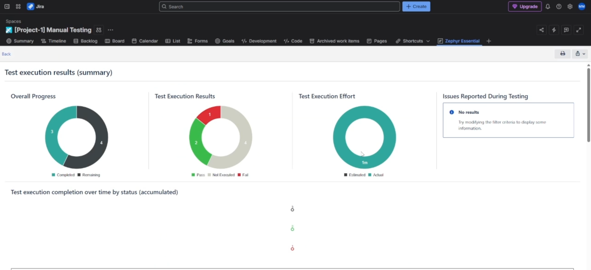

# 🚀 Manual Testing Project – Automation Exercise

<p align="center">


</p>

---

# 📖 Project Overview

This repository showcases a complete **Manual Testing** project for the **Automation Exercise** web application using **Jira** and **Zephyr Scale**.

The project demonstrates the complete manual testing lifecycle in an Agile environment, including sprint planning, test case management, test execution, and reporting.

A total of **26 manual test cases** were designed, organized, executed, and managed using Jira and Zephyr Scale following industry-standard QA practices.

---

# 🎯 Project Objectives

- Plan testing activities using Agile methodology.
- Create Epics and User Stories in Jira.
- Design and organize manual test cases.
- Execute test cases using Zephyr Scale.
- Manage testing through Test Cycles.
- Generate execution reports.
- Simulate a real-world QA workflow.

---

# 🌐 Application Under Test

**Website**

https://automationexercise.com

Automation Exercise is a demo e-commerce application widely used for learning software testing and automation.

---

# 🛠 Tools & Technologies

| Tool | Purpose |
|------|---------|
| Jira | Project Management |
| Zephyr Scale | Test Management |
| Agile Scrum | Sprint Planning |
| Manual Testing | Functional Testing |

---

# 📊 Project Summary

| Item | Details |
|------|---------|
| Project Type | Manual Testing |
| Application | Automation Exercise |
| Methodology | Agile Scrum |
| Project Management | Jira |
| Test Management | Zephyr Scale |
| Total Test Cases | **26** |
| Test Execution | Completed |
| Test Cycles | Created |
| Reports | Generated |

---

# 📋 QA Workflow

```text
Requirements
      │
      ▼
Create Epics
      │
      ▼
Create User Stories
      │
      ▼
Sprint Planning
      │
      ▼
Create Test Cases
      │
      ▼
Execute Test Cycle
      │
      ▼
Generate Reports
```

---

# 📸 Project Walkthrough

## 📌 Jira Backlog

> Created and organized the project backlog with Epics and User Stories.

<p align="center">

</p>

---

## 📌 Sprint Planning

> Planned the testing activities by creating and managing project sprints.

---

## 📌 User Stories

> User Stories were created and linked to the Sprint for effective Agile management.

<p align="center">

</p>

---

## 📌 Test Case Management

All **26 manual test cases** were documented in Zephyr Scale with:

- Preconditions
- Test Steps
- Expected Results


<p align="center">

</p>
<p align="center">

</p>
<p align="center">

</p>

---

## 📌 Test Execution

A dedicated Test Cycle was created to execute and monitor all test cases.

<p align="center">

</p>

---

## 📌 Execution Reports

Execution reports were generated using Zephyr Scale to monitor testing progress and execution results.

<p align="center">

</p>

---

# 🎥 Project Demonstration

A complete walkthrough of the project demonstrates:

- Creating Epics
- Creating User Stories
- Sprint Planning
- Test Case Creation
- Test Execution
- Test Cycle Management
- Report Generation

> 📹 **Project Demo:** *(Embed the GitHub video or add the YouTube/Drive link here.)*

---

# 💡 Skills Demonstrated

- ✅ Manual Testing
- ✅ Functional Testing
- ✅ Agile Methodology
- ✅ Jira
- ✅ Zephyr Scale
- ✅ Test Case Design
- ✅ Test Case Management
- ✅ Test Execution
- ✅ Sprint Planning
- ✅ User Story Management
- ✅ QA Documentation
- ✅ Test Reporting


---

# 📚 Key Takeaways

This project strengthened my understanding of:

- Manual Test Planning
- Test Design Techniques
- Agile Testing Workflow
- Test Management with Zephyr Scale
- Jira Project Organization
- Test Execution & Reporting
- End-to-End QA Documentation

---

# 👨‍💻 Author

**Mostafa Mahmoud**

**Software Test Engineer**

🏅 ISTQB® Certified Tester Foundation Level (CTFL v4.0)

---

⭐ If you found this project interesting, feel free to explore my other Software Testing repositories.
